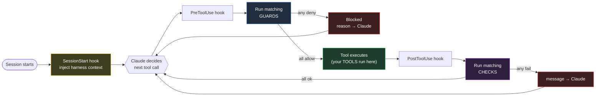

# How it works

The harness sits between Claude Code and its tool calls. Claude Code emits
**hooks** at fixed points in its agentic loop — `SessionStart`, `PreToolUse`,
`PostToolUse` — and the harness registers a handler on each. You write the
policies; the harness wires them to the loop.

## The loop

- **SessionStart** injects the harness's conventions into context so Claude knows
  the project's rules before it does anything.
- **PreToolUse** runs your **guards** against the proposed call. A deny exits the
  hook with code 2; Claude sees the reason and tries something else.
- The call executes. If it targets one of your **tools**, your handler runs.
- **PostToolUse** runs your **checks** against the resulting state. A failure
  hands Claude an actionable message; it fixes and re-runs.

## What each primitive does

### Guards

Fire on `PreToolUse`. They receive the proposed call — tool name and input —
and decide whether to allow or deny. The decision is made before the call
happens, so guards can prevent damage that no post-action correction could undo.

`run` is async and can do anything JS can: read project files, check git
state, query a manifest, hit a local API. The constraint is *information,
not power* — a guard sees the proposal, not the result.

- **Returns** `guardAllow()` or `guardDeny(reason)`.
- **Activation:** declarative `tools` / `files` / `when` conditions decide *if*
  the guard runs at all — a coarse filter ahead of the dynamic logic in `run`.
- **Use for** irreversible damage, secret leaks, scope and command-level
  policy, and conventions decidable from the proposed call alone.

→ [Guards](/guides/guards)

### Checks

Fire on `PostToolUse` (or `Stop`, for end-of-turn audits). They receive the file
path that was edited and validate the resulting state — anything you can
express in code. Shell out to a linter or test runner, walk the AST, read a
sibling file, query a manifest. If the answer is "this isn't ok," return a
failure with a message the agent can act on.

- **Returns** `checkOk()` or `checkFail(message)`.
- **Activation:** the same `tools` / `files` / `when` conditions as guards.
- **Use for** lint, types, tests, architecture, style and conventions,
  contract drift — anything fixable on the next iteration.

→ [Checks](/guides/checks)

### Tools

Registered with the harness's MCP server, callable by Claude like any other
MCP tool.

- **Routing:** the `description` field is what Claude reads to decide when to
  call it. Make it specific.
- **Inputs:** zod-validated at the boundary via `inputSchema`. Bad input never
  reaches the handler.
- **Returns** the result envelope (next section).

→ [Tools](/guides/tools)

## Guard vs. check — picking the right one

| | Guard | Check |
|---|---|---|
| Fires | before the tool runs | after the tool runs |
| Power | can **deny** the call | reports **fail**; agent fixes next turn |
| Use for | irreversible damage, secrets, scope | lint, types, tests, architecture, style, conventions, contracts |
| Cost of a miss | high — the action already happened | low — caught and corrected |

---

You'll sometimes see guards called **feedforward** and checks called
**feedback** — the standard harness-engineering vocabulary
([Anthropic](https://www.anthropic.com/engineering/harness-design-long-running-apps),
[Fowler](https://martinfowler.com/articles/harness-engineering.html)).
